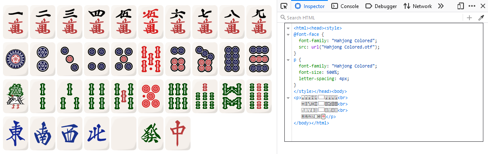

# Mahjong Colored 🀄
Colored OpenType-SVG Mahjong font based on [FluffyStuff/riichi-mahjong-tiles](https://github.com/FluffyStuff/riichi-mahjong-tiles).



## Usage
[U+1F000 → U+1F021 and U+1F02C → U+1F02E](https://en.wikipedia.org/wiki/Mahjong_Tiles_(Unicode_block)). The last three are akadora, undefined in Unicode (sue me). Flowers, seasons, etc. are not supported, but feel free to PR.

U+1F004 is also an emoji. You can specify the text version with U+FE0F VS16 or the emoji with U+FE0E VS15.

See: [colorfonts.wtf](https://www.colorfonts.wtf/).

## Alternative
This font is good for typical Riichi Mahjong. Monotype/Microsoft's *Segoe UI Emoji* font is better for some other variants; it includes colored glyphs U+1F000 → U+1F02B, but lacks akadora tiles. Plus, it ships with Windows.

I'm not aware of any other fonts with colored Mahjong tiles.

## Development
### Requirements
* [riichi-mahjong-tiles](https://github.com/FluffyStuff/riichi-mahjong-tiles)
* [rsvg-convert](https://github.com/brion/librsvg)
* [svg_stack](https://github.com/astraw/svg_stack)
* [scfbuild](https://github.com/13rac1/scfbuild)

### Reproduction
```
git clone https://github.com/FluffyStuff/riichi-mahjong-tiles
cd riichi-mahjong-tiles/Regular

for original in *.svg; do
    small="$(echo "$original" | sed 's/svg$/small.svg/')"
    rsvg-convert "$original" -w 237 -h 316 -f svg -o "$small"
done

for tile in *.small.svg; do
    stacked=$(echo $tile | sed 's/\.small//')
    svg_stack.py --direction=h --margin=-268.5 Front.svg $tile > $stacked
    sed -i 's/width="268.5"/width="300"/' $stacked
done

rm *.small.svg Back.svg Blank.svg Front.svg

# Rename the files like 1f000.svg .. 1f02e.svg. I just did this manually.

scfbuild -o 'Mahjong Colored.otf' -g . -s . --font-family 'Mahjong Colored'
```

## License
[Creative Commons Attribution 4.0 International License](http://creativecommons.org/licenses/by/4.0/). The tiles are from [FluffyStuff/riichi-mahjong-tiles](https://github.com/FluffyStuff/riichi-mahjong-tiles).
